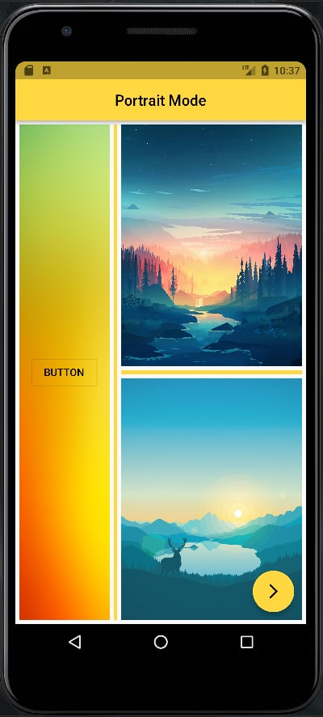
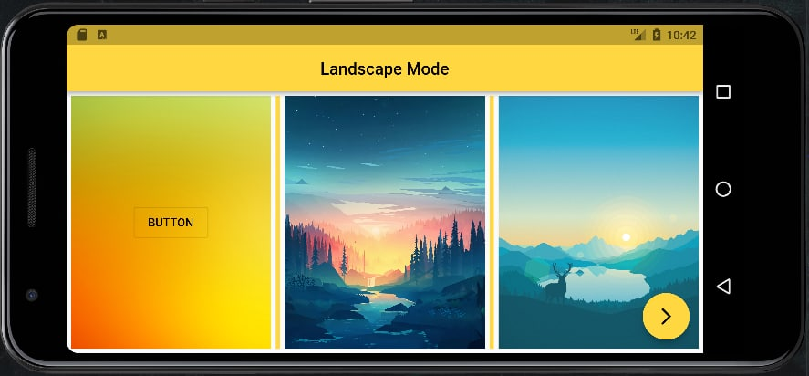
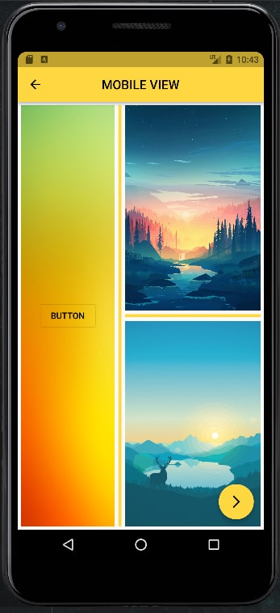
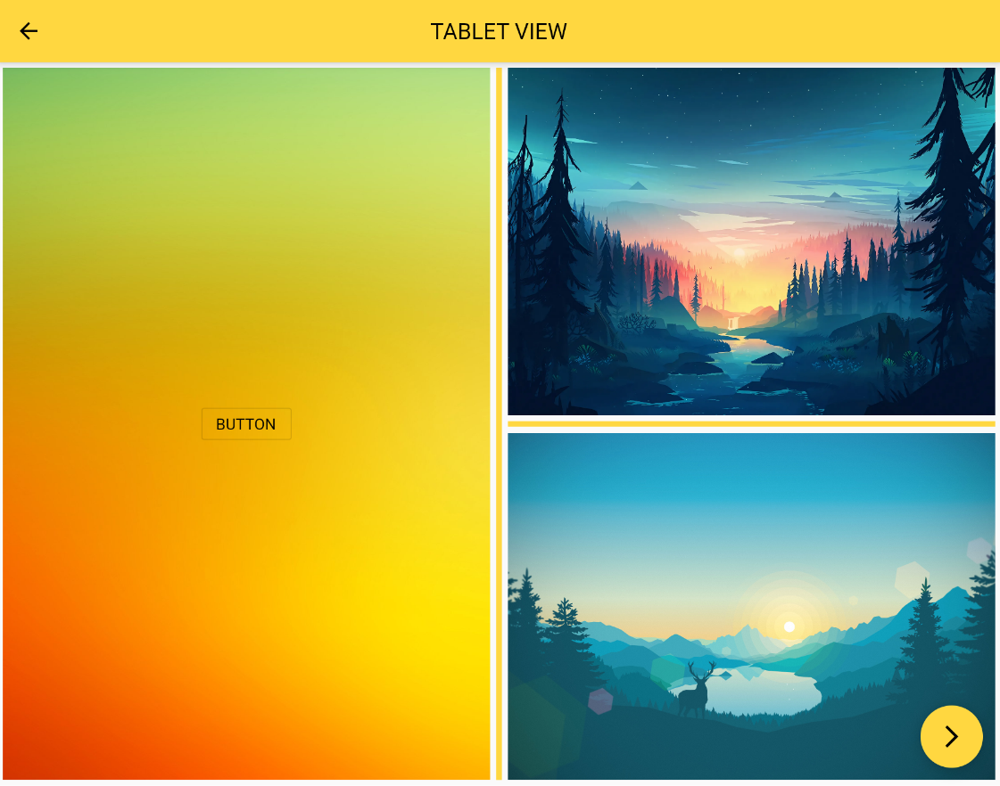
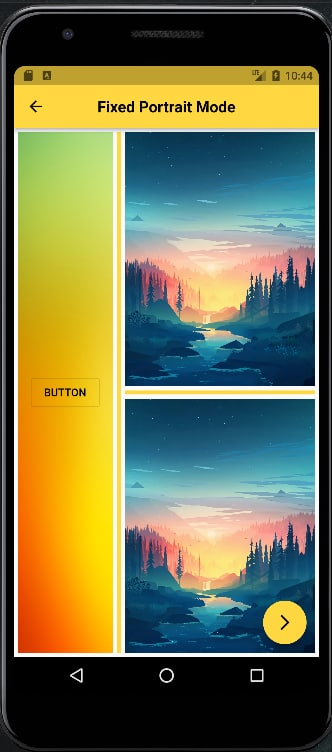
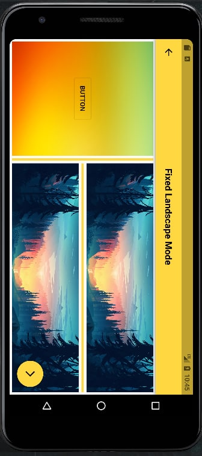
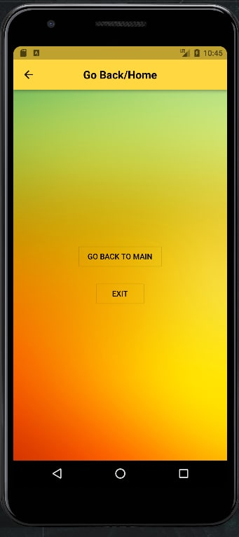

# Orientation

- [Update page after coming back to it from another page => To keep page orientation state](https://stackoverflow.com/questions/52689049/flutter-navigate-to-a-new-screen-and-clear-all-the-previous-screens)
- [Double tap to exit & Exit button](https://www.youtube.com/watch?v=desUOyDN_dc)
- [Detect platform](https://flutter-examples.com/flutter-detect-device-platform-is-android-or-ios/)
- [Detect platform](https://www.flutterclutter.dev/flutter/tutorials/how-to-detect-what-platform-a-flutter-app-is-running-on/2020/127/)

### First Page :
| Portrait Mode | Landscape Mode |
|----------------|:----------------:|
|  |  |

### Second Page :
| Mobile  | Tablet |
|----------------|:----------------:|
|  |  |

### Third & Fourth Page :
| Fixed Portrait Mode | Fixed Landscape Mode |
|----------------|:---------:|
|  |  |

### Last Page :
| Last Page |
|----------------|
|  |

